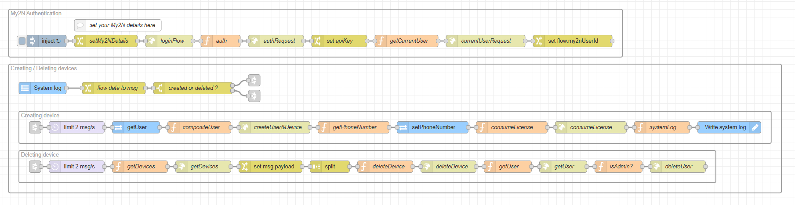

# Node-RED Flow Documentation

### Description

This flow automatically creates and assigns phone numbers from the My2N cloud to newly created users in the 2N Access Commander. It solves the problem of manual number provisioning by using the My2N cloud API to create a mobile video device and then assigning its number to the newly created users, thereby automating the setup of My2N cloud calling.

### Features

* Automated assignment of My2N phone numbers, eliminating manual configuration.

* Uses the My2N cloud API to create mobile video devices and assigns their phone numbers to the created users.

* Handles automatic deletion on the My2N when a user is deleted from the 2N Access Commander.

### Requirements

#### 2N Access Commander

* `3.4.0`

#### My2N account

* Cloud calling is a paid feature and **requires a license**.

* My2N site **must** be a type of **Commercial**.

### Installation and Setup

#### 1. Importing the Flow

1. Download the JSON code [flows.json](flows.json) file.

2. In your Node-RED editor (`Access Commander Automation`), go to the menu (top right) and select **Import**.

3. Choose **Clipboard** and paste the JSON code or **select a file to import**.

4. Click **Import**.

#### 2. Configuration

  * **My2N Settings**

    1. Locate the `change` node (*setMy2NDetails*).

    2. Double-click on the node to open its properties.

    3. Configure the My2N details (username, password, companyId, and siteId). To retrieve the company ID and site ID, open the site in [my2n.com](https://my2n.com) and check the URL:
    
      * 

    4. Ensure everyting is set correctly, clikc on `Done` and `Deploy` the flow.

### Usage

* Once the flow is deployed, any newly created user in the 2N Access Commander will automatically receive a phone number from the My2N Cloud.

* It is strongly recommended to **fill in the user's email address** during creation so that they can use their My2N login details for the My2N application and be notified via email. Without a filled email address, the notification will be sent to the user whose username was used to connect with the My2N API.

### Flow Diagram

### Flow Details and Explanation

#### 1. Input Trigger

* **Nodes Used:** `inject`, `System log`

* **Logic:** The `inject` node is configured to trigger after deployment and then every 50 minutes, sending a message to the `http request` (authRequest) node to authenticate with the My2N API and receive an authentication token.
This token must be periodically refreshed.\Once the System is blah blah

#### 2. Data Processing (e.g., "API Call and Data Transformation")

* **Purpose:** Describe the processing steps.

* **Nodes Used:** List relevant nodes (e.g., `HTTP Request`, `JSON`, `Change`).

* **Logic:** Explain how data is fetched, parsed, and transformed. "The `HTTP Request` node calls the weather API. The response is then parsed by the `JSON` node. Finally, the `Change` node extracts the temperature and humidity values from `msg.payload` and renames them to `msg.temperature` and `msg.humidity`."

#### 3. Output Action

* **Nodes Used:** List relevant nodes (e.g., `Telegram Sender`, `Debug`).

* **Logic:** Explain how the processed data is used. "The `Telegram Sender` node constructs a message using `msg.temperature` and `msg.humidity` and sends it to the configured chat ID. A `Debug` node is also connected to show the final message in the debug sidebar."

### Troubleshooting

* **Common Issues:**

  * `Warn: "Unauthorized, wrong username or password."`: Ensure the username and password are correctly configured in the `change` (*setMy2NDetails*) node.

  * `Phone numbers are not created`: The Company ID or Site ID are not set up properly, or a device with the same name (user's name) already exists.

### Limitations and Known issues:

  * This flow works only for **newly created users**, old users will not be affected.
  
  * All phone numbers are created in the first position, potentially overwriting whatever was in that position (e.g. a user with a phone number created by CSV import).

  * If you manually delete a phone number from a user in 2N Access Commander, it **will not** be synchronised back or deleted from the My2N portal.

  * If you manually delete a device (phone number) from the My2N portal, it **will not** automatically delete the corresponding phone number for that user in 2N Access Commander.

  * Phone numbers won't be created for users with **duplicate names** in the 2N Access Commander (My2N does not allow duplicate names on calling devices).

### Author and Versioning

* **Author:** [Kristian Velen](https://github.com/kv-0000)

* **Created On:** `[2025-08-04]`

* **Last Verified Working On:** `[2025-08-06]`

* **Verified with:**

  * **2N Access Commander:** `[3.4.0]`

### License

This Node-RED flow is released under the [MIT License](https://opensource.org/licenses/MIT).