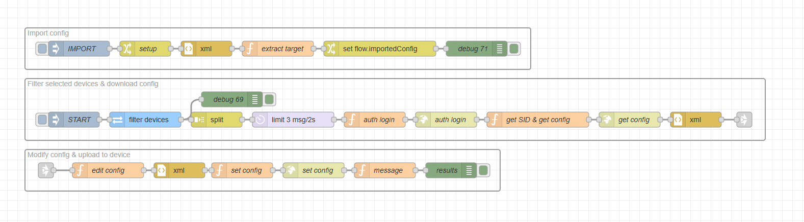

# Node-RED Flow Documentation

### Description

This flow automates the process of making targeted configuration changes to multiple devices within 2N Access Commander. It focuses on modifying specific parameters or settings on a selected (filtered) group of devices at the same time. This is especially useful for modifying a specific configuration parameter on a large number of devices.
It allows you to import (upload) an existing configuration and select the exact section you want to copy to filtered devices.

It utilises the 2N OS API to apply these changes, significantly reducing the manual effort of configuring each node device one by one.

### Features

* **Targeted Parameter Modification:** Focuses on updating specific, user-selected parameters.

* **Mass Configuration Change:** Applies a single change to multiple devices at once, saving significant time and effort.

* **2N OS API Integration:** Interacts with the [2N OS API](https://wiki.2n.com/hip/hapi/latest/en/5-prehled-funkci-http-api/5-3-api-config/5-3-1-api-config) to push the selected configuration changes.

### Requirements

#### 2N Access Commander

* `3.4.0+`

#### 2N OS

* `2.48.0+`

#### Hardware

* **any** 2N HW running 2N OS (see version above)

## Installation and Setup

### 1. Importing the Flow

1. Download the JSON code [flows.json](flows.json) file or copy its contents.

2. In your Node-RED editor (`Access Commander Automation`), go to the menu (top right) and select **Import**.

3. Choose **Clipboard** and paste the JSON code or **select a file to import**.

4. Click **Import**.

### 2. Configuration

#### Configuration import

Download the .xml configuration file from any 2N OS device that already contains the changes you want to copy to other devices (this flow does not support password encrypted backups). Open the file in your preferred text editor and copy the file contents.

1. Locate `change` (*setup*) node in the group "Import config".

2. Double-click each node to open its properties.

3. Paste the contents of the config file to the empty field to set the value of **msg.payload**.

4. Set the **msg.targetKey** using the name of the **main category** you want to copy from the source file and use for the filtered devices (e.g. Directory, Network, HttpApi).

#### Filtering

By default, the flow targets all intercoms and access units connected to the 2N Access Commander. If you want to target specific devices or a group, you need to adjust the filter.

1. Locate the `REST API` (*filter devices*) node.

2. Double-click each node to open its properties.

3. Configure the **Query** parameter to filter targeted devices. (see examples below)

    * Filter all online intercoms or access units:
      
      * `?filter={"$and":[{"State.Status":{"$eq":"Online"}},{"$or":[{"Hardware.Category":{"$in":["Intercom","AccessUnit"]}}]}]}`

    * Filter online devices with ID 1 or 4:
      
      * `?filter={"$and":[{"State.Status":{"$eq":"Online"}},{"$or":[{"Id":{"$in":[1,4]}}]}]}`

    * Filter online devices containing product name Style or Verso:
      
      * `?filter={"$and":[{"State.Status":{"$eq":"Online"}},{"$or":[{"Hardware.ProductName":{"$cti":"Style"}},{"Hardware.ProductName":{"$cti":"Verso"}}]}]}`

4. Ensure the filter is correct; otherwise, no device will be filtered.

## Usage

> [!CAUTION]
> All filtered devices may be subject to incorrect configuration. It is highly recommended to **create a backup** of all devices before running this flow.

> [!TIP]
> You can perform a mass configuration backup of all devices connected to 2N Access Commander. Select all devices from the **Devices** page and click on the cloud icon (Backup selected devices).

Once the flow is deployed and properly configured, click on the `inject` node to start the flow.

### Flow Diagram

### Flow Details and Explanation

The flow is divided into three main logical blocks: *Import config*, *Filter selected devices & download config*, and *Modify config & upload to device*. The first block handles the importing of existing configurations and selecting the copied category, ssecond block identifies the devices to be configured and retrieves their current configuration, the last part  uploads the updated configuration back to each device.

#### 1. Import configuration

* **Nodes Used:** `inject`, `change`, `xml`, `function`

* **Logic:** This block starts with an `inject` (*IMPORT*) node, which triggers the import of the xml configuration from `change` (*setup*) node where it is also specified exactly which part should be extracted (e.g., HttpApi). The `function` (*extract target*) node looks for the specific configuration data related to set **targetKey** and sends it to the `change` node to be saved into Node-RED's temporary memory (*flow context*) so it can be used later to configure filtered devices.

#### 2. Input Trigger, Filtering and Retrieve Configuration

* **Nodes Used:** `inject`, `REST API`, `split`, `function`, `http request`, `xml`

* **Logic:** This automation begins with the `inject` node, which manually triggers the entire flow. The `REST API` (*filter devices*) node queries the 2N Access Commander for a list of devices, specifically filtering for selected devices or a group of devices and retrieving their password, ID, name, and IP address. The resulting list is then processed by the `split` node, which breaks the array of devices into individual messages, allowing the rest of the flow to process each device one by one.  
For each device, the first `function` node (*auth login*) prepares a login request using the device's IP and password. The second `function` node (*get SID & get config*) then extracts the Session ID (SID) from the successful login response and prepares a new request `http request` (*get config*) to download the device's current configuration.

#### 3. Make Changes and Upload Configuration

* **Nodes Used:** `function`, `http request`, `xml`, `debug`

* **Logic:** The `function` (*config*) node takes the device's configuration and directly modifies the selected parameters. The `function` (*set config*) node then prepares the final HTTP request, and using the `http request` (*set config*) node, it uploads the modified configuration. Finally, the *message* `function` node constructs a result message which is sent to the `debug` (*message*) node, providing a log of the outcome for each device.

### Troubleshooting

* **Upload was successful, but nothing changed:** Not every parameter is supported by every 2N OS device; make sure that the uploaded configuration is compatible with the target devices. The device may accept the configuration file, but the actual configuration will not change because the device will ignore incompatible parameters.

### Limitations and Known issues:

  * If you have a lot of devices, it is recommended to increase the rate limiter.

## Author and Versioning

* **Author:** [Kristian Velen](https://github.com/kv-0000)

* **Company:** [2N](https://2n.com)

* **Created On:** `[2026-01-05]`

* **Last Verified Working On:** `[2026-01-19]`

* **Verified with:**

  * **2N Access Commander:** `[3.5.1]`

  * **2N OS:** `[3.0.0]`

### License

This Node-RED flow is released under the [MIT License](https://opensource.org/licenses/MIT).