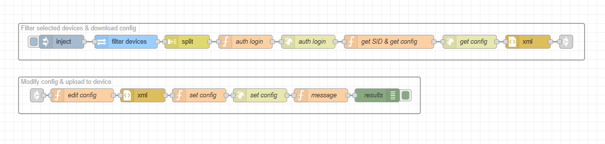

# Node-RED Flow Documentation

### Description

This flow automates the process of making targeted configuration changes to multiple devices within 2N Access Commander. It focuses on modifying specific parameters or settings on a selected (filtered) group of devices at the same time. This is especially useful for modifying a specific configuration parameter on a large number of devices.

It utilises the 2N OS API to apply these changes, significantly reducing the manual effort of configuring each node device one by one.

### Features

* **Targeted Parameter Modification:** Focuses on updating specific, user-selected parameters.

* **Mass Configuration Change:** Applies a single change to multiple devices at once, saving significant time and effort.

* **2N OS API Integration:** Interacts with the [2N OS API](https://wiki.2n.com/hip/hapi/latest/en/5-prehled-funkci-http-api/5-3-api-config/5-3-1-api-config) to push the selected configuration changes.

### Requirements

#### 2N Access Commander

* `3.4.0`

#### 2N OS

* `2.48.0`

#### Hardware

* **any** 2N HW running 2N OS (see version above)

## Installation and Setup

### 1. Importing the Flow

1. Download the JSON code [flows.json](flows.json) file or copy its contents.

2. In your Node-RED editor (`Access Commander Automation`), go to the menu (top right) and select **Import**.

3. Choose **Clipboard** and paste the JSON code or **select a file to import**.

4. Click **Import**.

### 2. Configuration

#### 1. Filtering

  By default, the flow targets all intercoms and access units connected to the 2N Access Commander. If you want to target specific devices or a group, you need to adjust the filter.

  1. Locate the `REST API` (*filter devices*) node.

  2. Double-click each node to open its properties.

  3. Configure the **Query** parameter to filter targeted devices. (see examples below)

    * Filter all intercoms and access units:
    
      * `?filter={"$or":[{"Hardware.Category":{"$eq":"Intercom"}},{"Hardware.Category":{"$eq":"AccessUnit"}}]}`

    * Filter devices with ID 1 or 4:
    
      * `?filter={"$or":[{"Id":{"$eq":1}},{"Id":{"$eq":4}}]}`

    * Filter devices containing product name Style or Verso:
    
      * `?filter={"$or":[{"Hardware.ProductName":{"$cti":"Style"}},{"Hardware.ProductName":{"$cti":"Verso"}}]}`

  4. Ensure the filter is correct; otherwise, no device will be filtered.

#### 2. Edit Configuration

> [!CAUTION]
> This is a crucial step and must be configured correctly; otherwise, all filtered devices may be subject to incorrect configuration. It is highly recommended to **create a backup** of all devices before running this flow.

> [!TIP]
> You can perform a mass configuration backup of all devices connected to 2N Access Commander. Select all devices from the **Devices** page and click on the cloud icon (Backup selected devices).

  By default, the configuration in this flow is set to apply the **Time Profile** stored in the first position as the **Hold Switch Time Profile**.

  1. Locate the `function` (*edit config*) node.

  2. Double-click the node to open its properties.

  3. Modify the `payload` message, keep in mind that the JSON structure will be converted to XML later in order to be uploaded to the device.

      ```javascript

      // .... start of the code ... 

        msg.payload = {
            DeviceDatabase: {
                $: config.$,

                // from this point you can edit the configuration as you like
                Switches: [
                    {
                        Switch: {
                            $: {At: "0"},
                            HoldSwitchTimeProfile: `P=0`
                        } 
                    }
                ]
                                
            }
        };

      // ... rest of the code ...

      ```

  4. Save the change by pressing `Done`.

> [!NOTE]
> If you do not know how to properly create the configuration structure, please refer to the `config.xml` file, which can be downloaded from any 2N OS device. You can also find configuration examples [here](examples/).

## Usage

* Once the flow is deployed and properly configured, click on the `inject` node to start the flow.

### Flow Diagram



### Flow Details and Explanation

The flow is divided into two main logical blocks: *Filter selected devices & download config* and *Modify config & upload to device*. This first block identifies the devices to be configured and retrieves their current settings, the second part modifies and uploads the updated configuration back to each device.

#### 1. Input Trigger, Filtering and Retrieve Configuration

* **Nodes Used:** `inject`, `REST API`, `split`, `function`, `http request`, `xml`

* **Logic:** This automation begins with the `inject` node, which manually triggers the entire flow. The `REST API` (*filter devices*) node queries the 2N Access Commander for a list of devices, specifically filtering for selected devices or a group of devices and retrieving their password, ID, name, and IP address. The resulting list is then processed by the `split` node, which breaks the array of devices into individual messages, allowing the rest of the flow to process each device one by one.  
For each device, the first `function` node (*auth login*) prepares a login request using the device's IP and password. The second `function` node (*get SID & get config*) then extracts the Session ID (SID) from the successful login response and prepares a new request `http request` (*get config*) to download the device's current configuration.

#### 2. Make Changes and Upload Configuration

* **Nodes Used:** `function`, `http request`, `xml`, `debug`

* **Logic:** The `function` (*edit config*) node is the core of the configuration change logic; it takes the device's configuration and directly modifies specific parameters. The `function` (*set config*) node then prepares the final HTTP request, and using the `http request` (*set config*) node, it uploads the modified configuration. Finally, the *message* `function` node constructs a result message which is sent to the `debug` (*message*) node, providing a log of the outcome for each device.

### Troubleshooting

* **Upload was successful, but nothing changed:** Make sure that the configuration structure is correct and does not contain any typos; the device may accept the configuration with typos, but the actual configuration will not change because the device will ignore the incorrectly configured parameters.

### Limitations and Known issues:

  * `N/A`

## Author and Versioning

* **Author:** [Kristian Velen](https://github.com/kv-0000)

* **Created On:** `[2025-08-12]`

* **Last Verified Working On:** `[2025-08-12]`

* **Verified with:**

  * **2N Access Commander:** `[3.4.0]`

  * **2N OS:** `[2.48.0]`

### License

This Node-RED flow is released under the [MIT License](https://opensource.org/licenses/MIT).