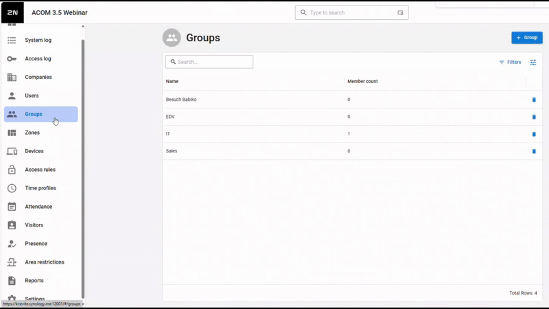
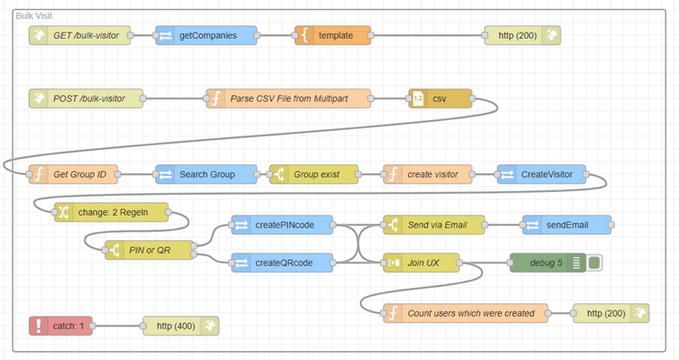

# Node-RED Flow Documentation

### Description

This flow powers a web-based bulk visitor import hosted in 2N Access Commander, streamlining the visitor check-in process. Visitor administrator can easily import csv file with a user-friendly interface. The flow then automatically creates a visitor records in the Access Commander, generates a unique QR code for access, and emails the credentials directly to the visitor if SMTP connector is defined.

This automated import allows for a seamless and efficient arrival experience, providing visitors with the necessary access credentials for the building and lifts.

Every company in the 2N Access Commander has specific working hours and default visitor groups. The working hours determine the validity period for new visitors, while the groups are used to define their access rules (which zones/devices the visitor can access).

### Features

* **Bulk Import**: Provides a user-friendly web interface for administrator to import more visitors in just few steps.

* **Visitor Management**: Creates a new visitor record in the 2N Access Commander using the submitted information.

* **Automated Credetial Delivery**: Automatically generates a QR code for the new visitor and sends it to their email address.

### Requirements

#### 2N Access Commander

* `3.5.1`

## Installation and Setup

### 1. Importing the Flow

1. Download the JSON code [flows.json](flows.json) file or copy its contents.

2. In your Node-RED editor (`Access Commander Automation`), go to the menu (top right) and select **Import**.

3. Choose **Clipboard** and paste the JSON code or **select a file to import**.

4. Click **Import**.

### 2. Configuration

* This flow **does not require** any **configuration** once deployed.

## Usage

Open the kiosk at `https://access_commander_ip_address/nodered/api/bulk-visitor`

### Flow Diagram

### Flow Details and Explanation

Provide a detailed explanation of each major section or logical block of the flow. Use headings to structure this section clearly.

#### 1. Input Trigger

* **Nodes Used:** `http in`, `template`, `REST API`

* **Logic:** When a user accesses the bulk import site via the specified path (*GET /bulk-visitor*), the system initiates a request to the 2N Access Commander via `REST API` (*getCompanies*) node. This request retrieves a list of available companies and is then used to populate the `template` node, which contains the necessary HTML, CSS, and JavaScript code to display the kiosk (webpage). Administrator will pick Credential type (QR or PIN) and upload CSV file with all visitors defined in the list.

#### 2. Data Processing

* **Nodes Used:** `REST API`, `function`, `change`

* **Logic:** When an administrator submits their information on the site, the flow begins by parsing the data with the change node. It then uses the `REST API` (*getCompany*) node to retrieve the selected company's working hours and default visitor groups. This retrieved data is then used in the `function` node to build a JSON body which is sent to 2N Access Commander via `REST API` (*createVisitor*) node to create the visitor. The script split every row in the csv file and handle every visitor with the creating process.

#### 3. Output Action

* **Nodes Used:** `REST API`

* **Logic:** Once the visitor is created the flow uses two `REST API` nodes, *createQRcode* or *createPINcode* and *sendQRcode* or *sendPINcode*, to generate a random PIN in the form of a QR code or PIN code, which is then sent to the visitor's specified email address. In case an administrator will not fill in the email address, the email with the credentials won't be sent.

### Troubleshooting

* **QR code/ PIN code was not received**: The 2N Access Commander needs a properly configured SMTP server to send credentials via email. If a visitor doesn't receive their QR code, the first step is to check and ensure that the SMTP server has been set up correctly.

* **QR code/ PIN code was received but no access is possible**: If a visitor receives a QR code/ PIN code but is unable to use it for access, verify that the selected company has defined **default groups for new visitors**. These groups are required to assign access rules for the visitors.

### Limitations and Known issues:

  * N/A

## Author and Versioning

* **Author:** [krizvite](https://github.com/krizvite)

* **Company:** [2N](https://2n.com)

* **Created On:** `[2026-01]`

* **Last Verified Working On:** `[2026-01]`

* **Verified with:**

  * **2N Access Commander:** `[3.5.1]`

### License

This Node-RED flow is released under the [MIT License](https://opensource.org/licenses/MIT).