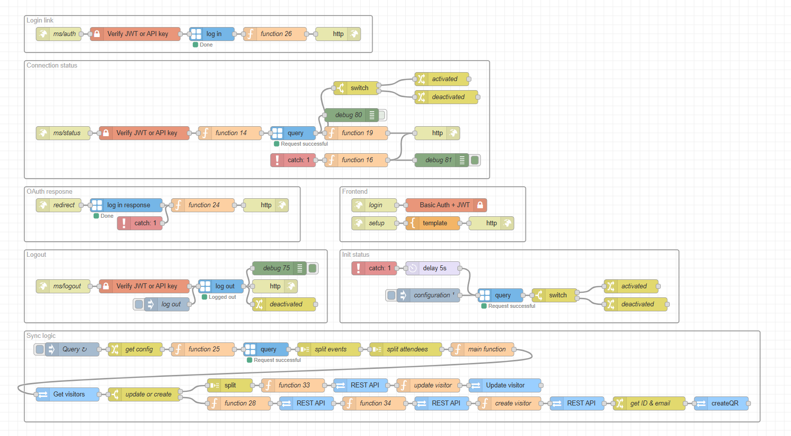

# Node-RED Flow Documentation

### Description

Instead of a receptionist manually entering visitor data into 2N Access Commander, the flow automatically creates the visitor inside the 2N Access Commander system.

The process is driven entirely by an Outlook calendar invite:

* When an employee invites a guest to a meeting and adds the `Equipment Mailbox` as one of the attendees, the flow automatically creates that guest in 2N Access Commander. No manual data entry is required. 

### Features

* **MS Graph Integration:** The flow connects to the MS Graph API to periodically retrieve calendar events and create visitors.

* **Automated Visitor Management:** The flow uses the 2N Access Commander API to automatically create visitors based on a scheduled meeting.

* **Access Provisioning:** Visitors will be issued a QR code valid for a window of one hour before and after their meeting. Guests can print their code at reception or receive it via email.

### Requirements

#### 2N Access Commander

* `3.5.1`

#### Palettes (Nodes/Modules)

* [`node-red-contrib-msgraph`](https://flows.nodered.org/node/node-red-contrib-msgraph)

## Installation and Setup

### 1. Installing Required Nodes

If you haven't already installed the required palettes, you can do so via the Node-RED Palette Manager:

1. Go to the Node-RED menu (top right) and select **Manage palette**.

2. Switch to the **Install** tab.

3. Search for each required palette/module (e.g., `node-red-contrib-msgraph`) and click **install**.

### 2. Importing the Flow

1. Download the JSON code [flows.json](flows.json) file or copy its contents.

2. In your Node-RED editor (`Access Commander Automation`), go to the menu (top right) and select **Import**.

3. Choose **Clipboard** and paste the JSON code or **select a file to import**.

4. Click **Import**.

### 3. Configuration

#### Microsoft configuration

1. Register your [Single Tenant Microsoft application](https://learn.microsoft.com/en-us/entra/identity-platform/quickstart-register-app).

2. Add web [Redirect Uri](https://learn.microsoft.com/en-us/entra/identity-platform/how-to-add-redirect-uri), in this format `https://access_commander_address/nodered/api/calendar/redirect` . 

3. Create [client secret credentials](https://learn.microsoft.com/en-us/entra/identity-platform/how-to-add-credentials?tabs=client-secret) for your app, do not forget to copy the secret; you will not be able to view it anymore.

4. [Add delegated permissions](https://learn.microsoft.com/en-us/entra/identity-platform/quickstart-configure-app-access-web-apis#application-permission-to-microsoft-graph) to Microsoft Graph API with scode `Calendars.Read` and **grant admin consent**.

#### Microsoft Account Configuration

1. Create [equipment mailbox](https://learn.microsoft.com/en-us/exchange/recipients/equipment-mailboxes#create-an-equipment-mailbox) which will be connected with 2N Access Commander.

2. Automatically [accept meeting requests and allow conflicts](https://learn.microsoft.com/en-us/exchange/recipients/equipment-mailboxes#change-how-an-equipment-mailbox-handles-meeting-requests).
 
#### MS Graph Configuration

1. Locate the `log in` node.

2. Double-click on the node to open its properties.

3. Configure the `ACOM` Client settings (Client ID, Tenant ID, Client Secret, Redirect URI).

4. Ensure everything is set correctly, click on `Update` and `Done`.

#### Username & Password

In order to open the setup page, you first need to create an account to access this page.

1. Locate the `Basic Auth + JWT` node (located in `Frontend` group, red color with padlock icon)

2. Double-click on the node to open its properties.

3. Set up your **username** and **password**.

4. Once set up, click on `Done`.

#### Setup Page

1. Open the setup page at `https://access_commander_ip_address/nodered/api/calendar/setup`

2. When prompted, enter the **username** and **password** you configured in the previous step.

3. Click on **Sign in with Microsoft**

4. Log in to the **equipment account** you want to read the calendar from.

5. You can verify the status using the indicator (Green = Activated).

6. If needed you can logout using the **Bin** icon.

#### QR Code Sending

You can also set the flow to automatically send the QR code once the user is created inside the 2N Access Commander. Do not forget to **enable and configure the SMTP service** in the 2N Access Commander settings.

1. Locate the `REST API` (*send QR*) node.

2. Double-click on the node to open its properties.

3. In the bottom left corner, click on **Disabled** (default), in order to **Enable** the node.

4. Once set up, click on `Done` and `Deploy`.

## Usage

* When creating a calendar invitation, **invite the account** `Equipment Mailbox` that is linked to 2N Access Commander. All attendees (expect users with the same domain) will be created inside 2N Access Commander as visitors (it is a similar workflow to booking a meeting room).

* Make sure the organizer is created in the 2N Access Commander database as a user; this will determine which company the visitor will be created in.

### Flow Diagram

### Limitations and Known issues:

  * If an invitee is not in your Outlook contacts (their name will not auto-populate), the visitor will be created in 2N Access Commander using their **email address as their name.**

  * The visitor cannot be created if the meeting organizer’s email address is **not** present in the 2N Access Commander (stored under the user). Without this match, the system cannot **determine** which **company** to assign the visitor to.

## Author and Versioning

* **Author:** [Kristian Velen](https://github.com/kv-0000)

* **Company:** [2N](https://2n.com)

* **Created On:** `[2026-02-01]`

* **Last Verified Working On:** `[2026-02-10]`

* **Verified with:**

  * **2N Access Commander:** `[3.5.1]`

### License

This Node-RED flow is released under the [MIT License](https://opensource.org/licenses/MIT).