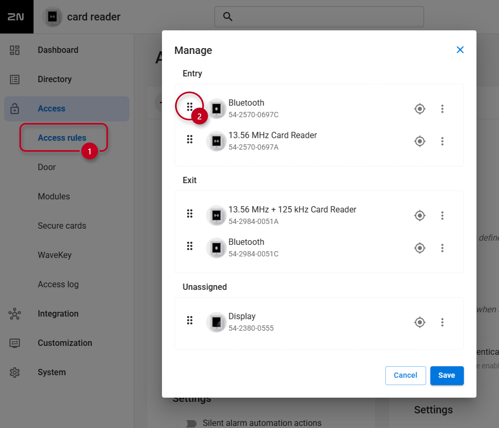

# Node-RED Flow Documentation

### Description

This flow enables automated user synchronization between HR system [Sloneek](https://www.sloneek.com/) and 2N Access Commander and real-time clock-in/out attednance monitoring via existing 2N devices.

### Features

* **Sloneek Integration:** The flow connects to the Sloneek API.

* **Automated User Management:** The flow periodically retrieves a list of all users and synchronizes them between the two systems.

* **Attendance Monitoring:** When a user authenticates on selected 2N devices, a notification is sent to the Sloneek attendance monitoring system.

### Requirements

#### 2N Access Commander

* `3.5.2`

## Installation and Setup

### 1. Importing the Flow

1. Download the JSON code [flows.json](flows.json) file or copy its contents.

2. In your Node-RED editor (`Access Commander Automation`), go to the menu (top right) and select **Import**.

3. Choose **Clipboard** and paste the JSON code or **select a file to import**.

4. Click **Import**.

### 2. Configuration

#### Username & Password

In order to open the setup page, you first need to create an account to access this page.

1. Locate the `Basic Auth + JWT` node (located in `Frontend` group, red color with padlock icon).

2. Double-click on the node to open its properties.

3. Set up your **username** and **password**.

4. Once set up, click on `Done`.

#### Setup Page

1. Open the setup page at `https://access_commander_ip_address/nodered/api/sloneek/setup`

2. When prompted, enter the **username** and **password** you configured in the previous step.

3. Click on the floating action button **Add company**.

4. Select the company from the list and input a **Client ID** and **Client Secret** provided by Sloneek.

5. Enable or disable the **Create Missing Users** option depending on whether you want to sync users with or import them from Sloneek (e.g., if you are connecting both systems to an external database, you want to leave this option disabled [sync only]).

6. If needed you can delete the configuration using the **Bin** icon.

#### Selecting 2N devices

It is expected that you have designated 2N devices for entry and exit in order to properly monitor user attendance, so it is important to select the correct devices to be used for this purpose (typically devices located on turnstiles or at the main entrance).

1. Locate the `Access log` node (located in `Clock IN / OUT` group).

2. Double-click on the node to open its properties.

3. Edit the filter and set the device IDs from which you want to receive the data (you can filter multiple devices separated by a comma).

> [!NOTE]
> You can find the device ID in the URL when opening the device details in 2N Access Commander.

4. Save the changes by pressing `Done`.

#### Configuration of 2N devices

Ensure that modules are correctly configured in 2N OS devices to monitor `Entry` and `Exit` directions proeprly.

1. Open section **Access rules**

2. **Drag & Drop** the module to select the direction.

## Usage

* After the setup is complete, the flow automatically retrieves all users from Sloneek every 60 minutes and attempts to import or sync them.

* Once a user authenticates themselves on selected 2N devices, a clock-in/out notification is immediately sent to Sloneek via API (depending on the direction).

### Limitations and Known issues:

* To track attendance, both systems must be up and running; any discrepancies must be resolved manually in Sloneek.

* The system only captures **clock-in/out** timestamps without support for specifying exit reasons, such as medical leave or personal appointments.

## Usage Statistics (beta)

This flow includes a **Usage Statistics** subflow designed to help us improve our product and understand which features are most valuable to our users.

### What data is collected?

* **Flow Name & Version:** To see which versions are currently in the wild.

* **Installation ID:** A unique identifier from your 2N Access Commander, this identifier is never tied to actual users.

* **System Version:** The version of the 2N Access Commander you are running.

> [!NOTE]  
> No personal data, IP addresses, credentials, or specific configuration values (like passwords or device names) are ever collected or stored.

### How to Opt-Out

You have full control over your data. To disable telemetry:

1. Before you on click deploy, double-click the `Usage Statistics` subflow node in your workspace.

2. **Uncheck** the box next to "Send Anonymous Statistics Data".

3. Click `Done` and `Deploy`.

Alternatively, you can delete the subflow node entirely from your flow without affecting the core functionality.

## Author and Versioning

* **Author:** [Kristian Velen](https://github.com/kv-0000)

* **Company:** [2N](https://2n.com)

* **Created On:** `[2026-03-1]`

* **Last Verified Working On:** `[2026-03-24]`

* **Verified with:**

  * **2N Access Commander:** `[3.5.2]`

### License

This Node-RED flow is released under the [MIT License](https://opensource.org/licenses/MIT).