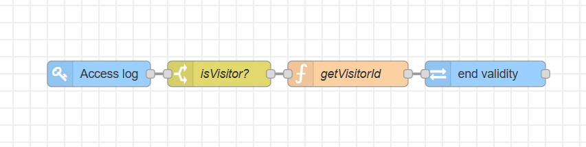

# Node-RED Flow Documentation Template

### Description

This flow provides one-time access for visitors. Once a visitor's credential is used to enter, it is immediately cancelled and cannot be used again, preventing the reuse of the same credential to enter again later.

### Features

* One-Time Access Control: The primary function is to grant access only once.

* API Integration: It integrates with the 2N Access Commander API to manage the visitors' credentials.

* Automated Credential Revocation: The flow automatically calls an API command to cancel a visitors' credential upon successful entry.

### Requirements

#### 2N Access Commander

* `3.3.0`

#### 2N OS

* `2.46.0`

#### Hardware

* **2N Access Unit** or **2N IP Intercom**

  * module or model that supports visitors' credentials (`PIN`, `RFID`, `QR`, `LPR`)  

#### Palettes (Nodes)

* this flow `does not require` any 3rd party nodes

### Installation and Setup

#### 1. Importing the Flow

1. Download the JSON code [flows.json](flows.json) file.

2. In your Node-RED editor (`Access Commander Automation`), go to the menu (top right) and select **Import**.

3. Choose **Clipboard** and paste the JSON code or **select a file to import**.

4. Click **Import**.

#### 2. Configuration

* This flow requires no special setup, just upload the flow and hit `Deploy`. 

### Usage

* Once the flow is deployed, a visitor's credentials will be terminated immediately after their first successful access on any devices added into the 2N Access Commander.

### Flow Diagram

### Flow Details and Explanation

Provide a detailed explanation of each major section or logical block of the flow. Use headings to structure this section clearly.

#### 1. Input Trigger (e.g., "Schedule Checker")

* **Purpose:** Briefly describe what this section does.

* **Nodes Used:** List the key nodes (e.g., `Inject`, `Function`, `MQTT In`).

* **Logic:** Explain the logic within this section. For example, "This `Inject` node is configured to trigger every 5 minutes, sending a message to the `Function` node. The `Function` node then checks the current time and day to determine if the automation should proceed."

#### 2. Data Processing (e.g., "API Call and Data Transformation")

* **Purpose:** Describe the processing steps.

* **Nodes Used:** List relevant nodes (e.g., `HTTP Request`, `JSON`, `Change`).

* **Logic:** Explain how data is fetched, parsed, and transformed. "The `HTTP Request` node calls the weather API. The response is then parsed by the `JSON` node. Finally, the `Change` node extracts the temperature and humidity values from `msg.payload` and renames them to `msg.temperature` and `msg.humidity`."

#### 3. Output Action (e.g., "Notification Sender")

* **Purpose:** Describe the final action.

* **Nodes Used:** List relevant nodes (e.g., `Telegram Sender`, `Debug`).

* **Logic:** Explain how the processed data is used. "The `Telegram Sender` node constructs a message using `msg.temperature` and `msg.humidity` and sends it to the configured chat ID. A `Debug` node is also connected to show the final message in the debug sidebar."

### Author and Versioning

* **Author:** [Kristian Velen](https://github.com/kv-0000)

* **Created On:** `[2025-07-30]`

* **Last Verified Working On:** `[2025-07-30]`

* **Verified with:**

  * **2N Access Commander:** `[3.3.0]`

  * **2N OS:** `[2.46.0]`

### License

This Node-RED flow is released under the [MIT License](https://opensource.org/licenses/MIT).