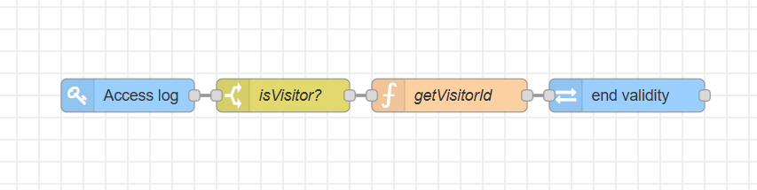

# Node-RED Flow Documentation

### Description

This flow provides one-time access for visitors. Once a visitor's credential is used to enter, it is immediately cancelled and cannot be used again, preventing the reuse of the same credential to enter again later.

### Features

* One-Time Access Control: The primary function is to grant access only once.

* API Integration: It integrates with the 2N Access Commander API to manage the visitors' credentials.

* Automated Credential Revocation: The flow automatically calls an API command to cancel a visitors' credential upon successful entry.

### Requirements

#### 2N Access Commander

* `3.3.0`

#### 2N OS

* `2.46.0`

#### Hardware

* **2N Access Unit** or **2N IP Intercom**

  * module or model that supports visitors' credentials (`PIN`, `RFID`, `QR`, `LPR`)  

#### Palettes (Nodes)

* this flow `does not require` any 3rd party nodes

### Installation and Setup

#### 1. Importing the Flow

1. Download the JSON code [flows.json](flows.json) file or copy its contents.

2. In your Node-RED editor (`Access Commander Automation`), go to the menu (top right) and select **Import**.

3. Choose **Clipboard** and paste the JSON code or **select a file to import**.

4. Click **Import**.

#### 2. Configuration

* This flow requires no special setup, just upload the flow and hit `Deploy`. 

### Usage

* Once the flow is deployed, a visitor's credentials will be terminated immediately after their first successful access on **any** devices added into the 2N Access Commander.

### Flow Diagram

### Flow Details and Explanation

#### 1. Input Trigger

* **Nodes Used:** `Access log`

* **Logic:** This node monitors access logs from all devices in 2N Access Commander. It is configured to filter only events with the category `Granted`. The output of this node is a message (msg) containing the event data, including information about the person who attempted access.

#### 2. Data Processing

* **Nodes Used:** `switch`, `function`

* **Logic:** Using a `switch` node, the flow evaluates the incoming message from the `Access log` to determine whether the access was made by a visitor. If so, the message is forwarded to a `function` node, which constructs a JSON payload using the current time as the end validity of the visitor. 

#### 3. Output Action

* **Nodes Used:** `REST API`

* **Logic:** Previously constructed payload from the `fuction` node is used to update the visitor via REST API to block any subsequent access attempts using the same credentials, thereby suspending the visitor.

### Limitations and Known issues:

  * The current setup of the flow monitors the Access log from every single device connected to the 2N Access Commander. This means that once visitors use access on any device, their credentials will be suspended. However, you can configure the `Access log` node to monitor only certain devices.s

### Author and Versioning

* **Author:** [Kristian Velen](https://github.com/kv-0000)

* **Created On:** `[2025-07-30]`

* **Last Verified Working On:** `[2025-07-30]`

* **Verified with:**

  * **2N Access Commander:** `[3.3.0]`

  * **2N OS:** `[2.46.0]`

### License

This Node-RED flow is released under the [MIT License](https://opensource.org/licenses/MIT).