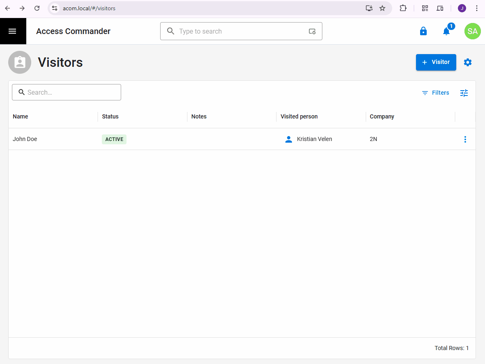
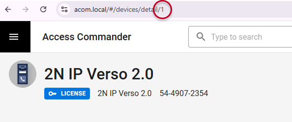
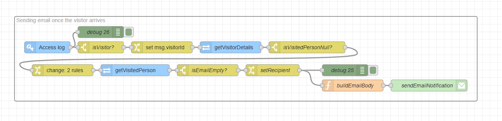

# Node-RED Flow Documentation

### Description

**Smart Arrival Notifications**

Never keep a guest waiting again. This flow bridges the gap between the front door and the desk by triggering an automated email alert the moment a visitor checks in. By using their unique QR code or PIN at any designated 2N entry device, the host is instantly notified of their guest's arrival, ensuring a professional welcome every time.

### Features

* **Automated Notification Delivery:** Automatically sends an email to the visited person when their visitor arrives (uses their received credential [PIN, QR] on selected 2N devices, e.g., main entrance device).

### Requirements

#### 2N Access Commander

* `3.5.2`

#### Palettes (Nodes/Modules)

* [`node-red-node-email`](https://flows.nodered.org/node/node-red-node-email)

## Installation and Setup

### 1. Installing Required Nodes

If you haven't already installed the required palettes, you can do so via the Node-RED Palette Manager:

1. Go to the Node-RED menu (top right) and select **Manage palette**.

2. Switch to the **Install** tab.

3. Search for each required palette/module (e.g., `node-red-node-email`) and click **install**.

### 2. Importing the Flow

1. Download the JSON code [flows.json](flows.json) file or copy its contents.

2. In your Node-RED editor (`Access Commander Automation`), go to the menu (top right) and select **Import**.

3. Choose **Clipboard** and paste the JSON code or **select a file to import**.

4. Click **Import**.

### 2. Configuration

#### Selecting 2N devices

To avoid sending email notifications when visitors use their login credentials on every single device, it is recommended to select only a few devices, typically at the main entrance or at the parking lot entrance.

1. Locate the `Access log` node.

2. Double-click on the node to open its properties.

3. Edit the filter and set the device IDs from which you want to receive the data (you can filter multiple devices separated by a comma).

> [!NOTE]
> You can find the device ID in the URL when opening the device details in 2N Access Commander.

4. Save the changes by pressing `Done`.

#### SMTP setup

In order to send emails you need to connect to external SMTP server. 

1. Locate the `email` (*sendEmailNotification*) node.

2. Double-click on the node to open its properties.

3. Fill in the correct details (Server, Port, Authentication, etc.) based on your SMTP settings.

4. Save the changes by pressing `Done`. 

#### Email body

You are free to create your own email body and style it according to your needs. The flow already includes a simple template, which you can adjust.

1. Locate the `function` (*buildEmailBody*) node.

2. Double-click on the node to open its properties.

3. Edit the `msg.topic` (string) variable to change the subject of the email and the `msg.payload` (string in HTML format) to change the body and style of the email.

4. Save the changes by pressing `Done`. 

## Usage

When creating a visitor in the 2N Access Commander, fill in the *Visited Person* (make sure the visited person has an email filled in). Once the visitor arrives and uses their received credential on selected 2N devices, the visited person is immediately notified.

### Flow Diagram

### Troubleshooting

* **Email was not send:** The you need a properly configured SMTP server to send credentials via email. The first step is to check and ensure that the SMTP server has been set up correctly.

* **Email was not received:** Visited persons (users) must have an email stored under their user account in 2N Access Commander to receive the email notification.

### Limitations and Known issues:

The email notification is not sent just once, but every time the visitor's credentials are used on selected 2N devices. However, it is expected that the visitors will use their credentials at the main entrance only once.

## Author and Versioning

* **Author:** [Kristian Velen](https://github.com/kv-0000)

* **Company:** [2N](https://2n.com)

* **Created On:** `[2025-03-10]`

* **Last Verified Working On:** `[2025-03-10]`

* **Verified with:**

  * **2N Access Commander:** `[3.5.2]`

### License

This Node-RED flow is released under the [MIT License](https://opensource.org/licenses/MIT).