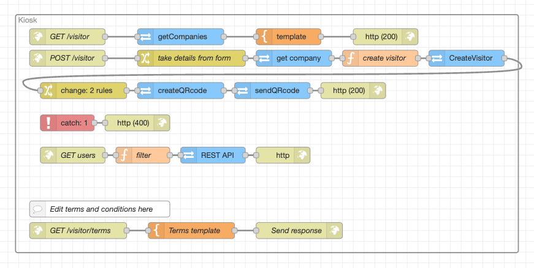

# Node-RED Flow Documentation

### Description

This flow powers a web-based visitor kiosk hosted in 2N Access Commander, streamlining the visitor check-in process. It builds on the excellent work of Kristian Velen. Visitors can easily self-onboard by entering their details into a user-friendly interface. The flow then automatically creates a visitor record in the Access Commander, generates a unique QR code for access, and emails the credentials directly to the visitor. Before the visitor can click 'Submit' they must first accept the terms and conditions. The T&Cs can be edited in the terms template to reflect the terms of the site or building.

This automated system allows for a seamless and efficient arrival experience, providing visitors with the necessary access credentials for the building and lifts without manual intervention from a receptionist.

Every company in the 2N Access Commander has specific working hours and default visitor groups. The working hours determine the validity period for new visitors, while the groups are used to define their access rules (which zones/devices the visitor can access).

### Features

* **Self-Onboarding:** Provides a user-friendly web interface for visitors to input their details directly.

* **Visitor Management:** Creates a new visitor record in the 2N Access Commander using the submitted information.

* **Automated Credential Delivery:** Automatically generates a QR code for the new visitor and sends it to their email address.

* **Terms and Conditions:** T&Cs must be accepted be clicking 'Submit'. Submit remains greyed out until the terms are acknowledged. Time and date of acceptance are written to the visitor notes section. T&Cs can be edited via HTML template included in the flow.

### Requirements

#### 2N Access Commander

* `3.5.2`

## Installation and Setup

### 1. Importing the Flow

1. Download the JSON code [flows.json](flows.json) file or copy its contents.

2. In your Node-RED editor (`Access Commander Automation`), go to the menu (top right) and select **Import**.

3. Choose **Clipboard** and paste the JSON code or **select a file to import**.

4. Click **Import**.

### 2. Configuration

* Edit the terms and conditions using basic HTML where advised in the flow. Example text is provided.

## Usage

Open the kiosk at `https://access_commander_ip_address/nodered/api/visitor`

### Flow Diagram

### Flow Details and Explanation

#### 1. Input Trigger

* **Nodes Used:** `http in`, `template`, `REST API`

* **Logic:** When a user accesses the kiosk via the specified path (*GET /visitor*), the system initiates a request to 2N Access Commander via the REST API (*getCompanies*) node. This request retrieves a list of available companies and populates the template node, which renders the kiosk webpage using embedded HTML, CSS, and JavaScript.
The rendered kiosk includes a mandatory terms and conditions acknowledgement. The submit button is initially disabled and is only enabled once the visitor confirms acceptance of the terms.

#### 2. Data Processing

* **Nodes Used:** `REST API`, `function`, `change`

* **Logic:** When a visitor completes the form and submits it, the flow begins by extracting the submitted values using the change node. If the visitor has accepted the terms and conditions, a timestamped confirmation is appended to the visitor note.
The flow then calls the `REST API` (*getCompany*) node to retrieve the selected company’s business hours and predefined visitor groups. This information is used by the function node to construct the visitor payload, which is sent to 2N Access Commander via the `REST API` (*CreateVisitor*) node to create the visitor record.

#### 3. Output Action

* **Nodes Used:** `REST API`

* **Logic:** Once the visitor has been successfully created, the flow triggers two `REST API` nodes, *createQRcode* and *sendQRcode*. These nodes generate a QR code containing a random PIN and deliver it to the visitor’s specified email address. The kiosk then provides visual confirmation that the process has completed successfully.

### Troubleshooting

* **QR code was not received:** The 2N Access Commander needs a properly configured SMTP server to send credentials via email. If a visitor doesn't receive their QR code, the first step is to check and ensure that the SMTP server has been set up correctly.

* **QR code was received but no access is possible:** If a visitor receives a QR code but is unable to use it for access, verify that the selected company has defined **default groups for new visitors**. These groups are required to assign access rules for the visitors.

### Limitations and Known issues:

  * `N/A`

## Author and Versioning

* **Author:** [Julian Salter](https://github.com/jules51x)

* **Company:** [2N](https://2n.com)

* **Created On:** `[2026-03-02]`

* **Last Verified Working On:** `[2026-03-02]`

* **Verified with:**

  * **2N Access Commander:** `[3.5.2]`

### License

This Node-RED flow is released under the [MIT License](https://opensource.org/licenses/MIT).

