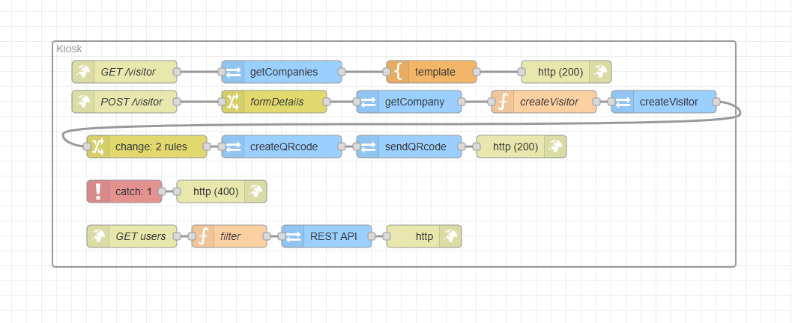

# Node-RED Flow Documentation Template

### Description

This flow powers a web-based visitor kiosk hosted in 2N Access Commander, streamlining the visitor check-in process. Visitors can easily self-onboard by entering their details into a user-friendly interface. The flow then automatically creates a visitor record in the Access Commander, generates a unique QR code for access, and emails the credentials directly to the visitor.

This automated system allows for a seamless and efficient arrival experience, providing visitors with the necessary access credentials for the building and lifts without manual intervention from a receptionist.

### Features

* **Self-Onboarding:** Provides a user-friendly web interface for visitors to input their details directly.

* **Visitor Management:** Creates a new visitor record in the 2N Access Commander using the submitted information.

* **Automated Credential Delivery:** Automatically generates a QR code for the new visitor and sends it to their email address.

### Requirements

#### 2N Access Commander

* `3.4.0`

### Installation and Setup

#### 1. Importing the Flow

1. Download the JSON code [flows.json](flows.json) file or copy its contents.

2. In your Node-RED editor (`Access Commander Automation`), go to the menu (top right) and select **Import**.

3. Choose **Clipboard** and paste the JSON code or **select a file to import**.

4. Click **Import**.

#### 2. Configuration

* This flow **does not require** any **configuration** once deployed.

### Usage

* Explain how to use the flow after it has been configured and deployed.

* Describe the expected inputs that trigger the flow (e.g., `Inject a timestamp`, `Send a message to the "start" topic with a payload of "true"`, `HTTP POST request to /my-endpoint`).

* Describe the expected outputs or behavior (e.g., `The flow will send a notification via email`, `It will update a dashboard chart`, `It will log data to a database`).

* Provide examples of input messages if relevant.

### Flow Diagram

### Flow Details and Explanation

Provide a detailed explanation of each major section or logical block of the flow. Use headings to structure this section clearly.

#### 1. Input Trigger (e.g., "Schedule Checker")

* **Nodes Used:** List the key nodes (e.g., `Inject`, `Function`, `MQTT In`).

* **Logic:** Explain the logic within this section. For example, "This `Inject` node is configured to trigger every 5 minutes, sending a message to the `Function` node. The `Function` node then checks the current time and day to determine if the automation should proceed."

#### 2. Data Processing (e.g., "API Call and Data Transformation")

* **Nodes Used:** List relevant nodes (e.g., `HTTP Request`, `JSON`, `Change`).

* **Logic:** Explain how data is fetched, parsed, and transformed. "The `HTTP Request` node calls the weather API. The response is then parsed by the `JSON` node. Finally, the `Change` node extracts the temperature and humidity values from `msg.payload` and renames them to `msg.temperature` and `msg.humidity`."

#### 3. Output Action (e.g., "Notification Sender")

* **Nodes Used:** List relevant nodes (e.g., `Email Sender`, `Debug`).

* **Logic:** Explain how the processed data is used. "The `Email Sender` node constructs a message using `msg.temperature` and `msg.humidity` and sends it to the configured chat ID. A `Debug` node is also connected to show the final message in the debug sidebar."

### Troubleshooting

* **Common Issues:** List any known issues and their solutions.

  * `Error: "Missing credentials"`: Ensure all API keys and sensitive information are correctly configured in the respective nodes or global context.

  * `Flow not triggering`: Check the `Inject` node settings or any preceding nodes for correct configuration.

### Limitations and Known issues:

  * List any possible limitations you have discovered.

### Author and Versioning

* **Author:** [Kristian Velen](https://github.com/kv-0000)

* **Created On:** `[2025-08-08]`

* **Last Verified Working On:** `[2025-08-08]`

* **Verified with:**

  * **2N Access Commander:** `[3.4.0]`

### License

This Node-RED flow is released under the [MIT License](https://opensource.org/licenses/MIT).